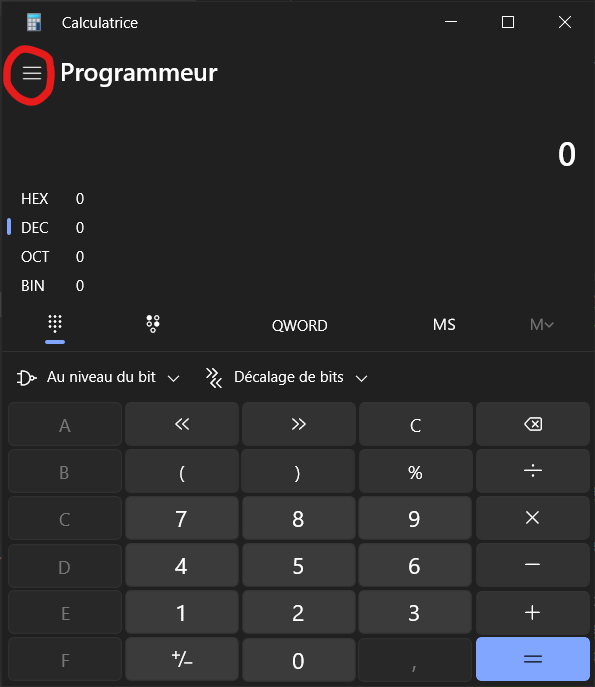
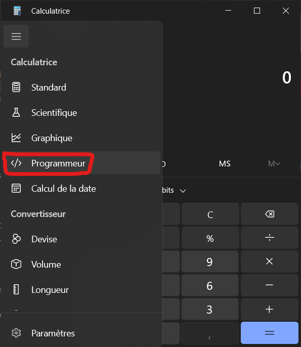
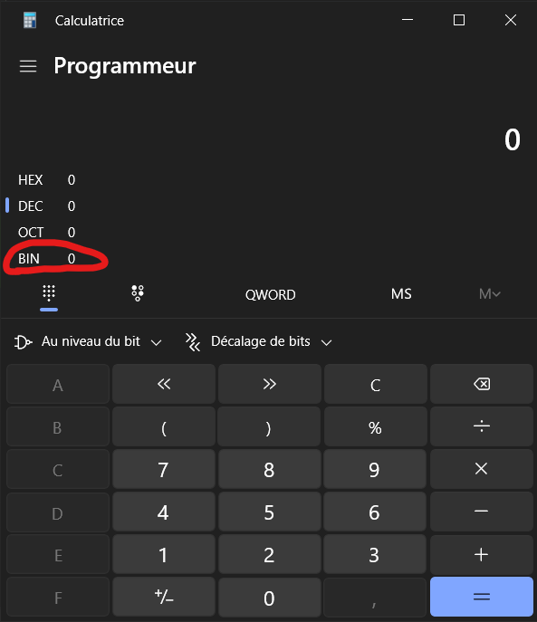
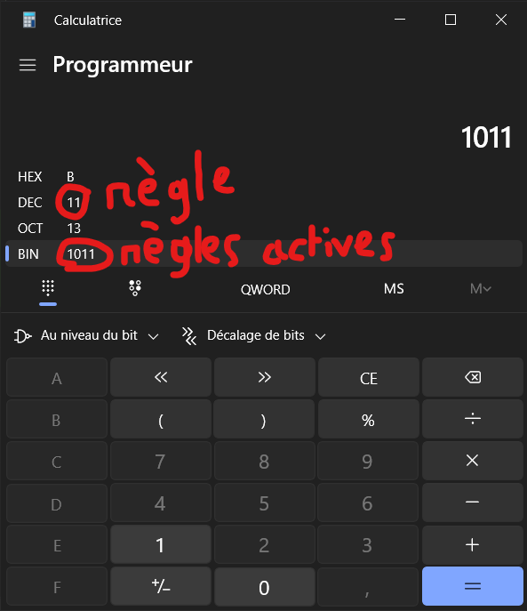
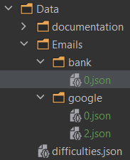

## Construction du fichier difficulties.json

- L'index de la liste est la difficulté.
- Les nombres entier représentent les règles actives.
- Les nombres se liront de la droite vers la gauche.

Cela permetra (si ont à le temps) de laisser aux joueurs controler les exercices qu'ils veulent travailler.

<u><b>Exemples:</b></u>

```json
[0, 5, 11, 15]
```

| nombre | représentation binaire |         règles actives |
|--------|-----------------------:|-----------------------:|
| 0      |                      0 |    Aucune règle active |
| 5      |                    101 |     règles 1,3 actives |
| 11     |                   1011 |   règles 1,2,4 actives |
| 15     |                   1111 | règles 1,2,3,4 actives |

Un outil très utile si vous avez du mal avec le binaire est la calculatrice de Windows.





## Construction des fichiers emails

- Les fichiers seront dans Data/Emails/context/
- Les fichiers seront nommé selon les règles actives mentioné si dessus 
  - <i>exemples: 0.json, 5.json, 11.json, 15.json</i>
  - 
- Les fichiers seont construits tel que:

```json
{
	"addresses": {
		"valid": [],
		"invalid": []
	},
	"header": {
		"valid": [],
		"invalid": []
	},
	"body": {
		"valid": [],
		"invalid": []
	},
	"footer": {
		"valid": [],
		"invalid": []
	}
}
```