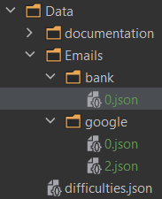

## Construction du fichier days.json

- L'index de la liste est le jour / le numéro de session.
- Les nombres entier représentent les règles actives.

<u><b>Exemples:</b></u>

```json
[0, 5, 11, 15]
```

| nombre | représentation binaire |         règles actives |
|--------|-----------------------:|-----------------------:|
| 0      |                      0 |    Aucune règle active |
| 5      |                    101 |     règles 1,3 actives |
| 11     |                   1011 |   règles 1,2,4 actives |
| 15     |                   1111 | règles 1,2,3,4 actives |


## Construction des fichiers emails

- Les fichiers seront dans Data/Emails/context/
  - 
- Les fichiers seront nommé selon les règles actives mentioné si dessus 
  - <i>exemples: 0.json, 5.json, 11.json, 15.json</i>
- Les fichiers seont construits tel que:

```json
{
	"addresses": [],
	"headers": [],
	"bodies": [],
	"footers": []
}
```
